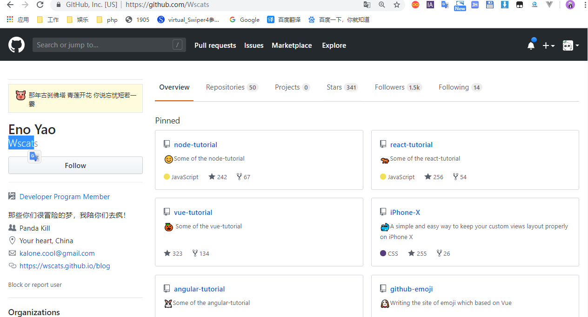

# 登录注册

用token改写

第一次用用户名和密码发到后端拿到令牌(只加密用户名)

第二次登录发cookie里面的token，去后端验证

# webpack

node跟前端的一条最重要的桥，是为前端服务

- 入口
- 出口
- 加载器
- 插件

# vue

# Github

组长先把组员所有github账号名，交给班长

|名字|链接|github账号|
|-|-|-|
|中文名|github.com/wscats|wscats|